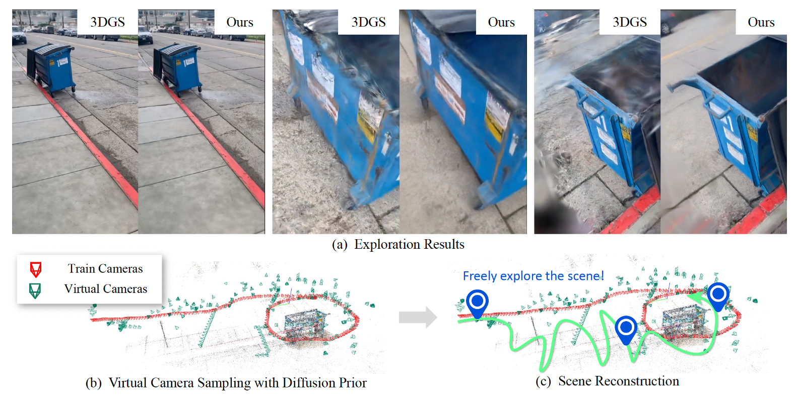
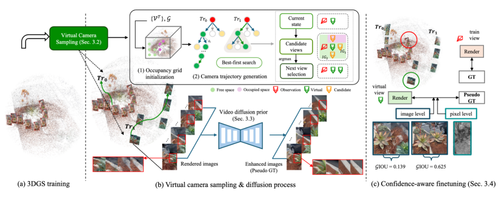

# ExploreGS
### ExploreGS: Explorable 3D Scene Reconstruction with Virtual Camera Samplings and Diffusion Priors (ICCV 2025)

<div align="center">
    
</div>

<div align="center">
    
</div>

---

## 👥 Authors
[Minsu Kim](https://minsu1206.github.io/), [Subin Jeon](https://sites.google.com/yonsei.ac.kr/subinjeon/home), [In Cho](https://sites.google.com/view/im-join), [Mijin Yoo](https://yoomimi.github.io/), [Seon Joo Kim](https://sites.google.com/site/seonjookim/)

## 🔗 Links
[Project page](https://exploregs.github.io/) | [Paper](https://arxiv.org/abs/2508.06014) | [Dataset]()

---

## 🗞️ News
- **[10/31/2025]** Code and models are now available!

---

## ⚙️ Setup

1. Code setup
    ```
    git clone https://github.com/exploregs/exploregs.git --recursive
    cd ExploreGS
    conda env create -f environment.yml
    conda activate exploregs
    pip install submodules/simple-knn
    pip install submodules/upgrade-diff-gaussian-rasterization
    pip install submodules/diff-gaussian-rasterization-fisherrf (If you want ablation)
    ```    

    Instead of conda install, you can download docker image
    ```
    docker pull minsu1206/exploregs
    ```

2. Download dataset & checkpoint
    - Run `download.sh`
    - Edit dataset & checkpoint path at `run_stage1.sh` , `run_stage2.sh` , `run_stage1_we.sh`, `run_stage2_we.sh`
    - Download Depth-Anything-V2 checkpoint. we use `vitl` version.
    - If you want to preprocess for custom dataset, read README.md at folder `data_preprocess` (#TBD)

## 🚀 Run
### ▶ Curated Nerfbusters
```
bash scripts/commands_curatednb.sh
```

### ▶ WildExplore
```
bash scripts/commands_wildexplore.sh
```

---

### Acknowledgements
Our work is built upon these excellent open-source projects:
- [3DGS](https://github.com/graphdeco-inria/gaussian-splatting)
- [Nerfbusters](https://github.com/ethanweber/nerfbusters)
- [DL3DV-10K](https://github.com/DL3DV-10K/Dataset)
- [3DGS-Enhancer](https://github.com/xiliu8006/3DGS-Enhancer)
- [DynamiCrafter](https://github.com/Doubiiu/DynamiCrafter)

### Citation
If you find this work useful, please consider citing:
```
@misc{kim2025exploregsexplorable3dscene,
      title={ExploreGS: Explorable 3D Scene Reconstruction with Virtual Camera Samplings and Diffusion Priors}, 
      author={Minsu Kim and Subin Jeon and In Cho and Mijin Yoo and Seon Joo Kim},
      year={2025},
      eprint={2508.06014},
      archivePrefix={arXiv},
      primaryClass={cs.CV},
      url={https://arxiv.org/abs/2508.06014}, 
}
```